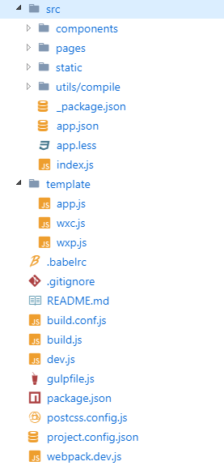

# 微信小程序打包目录

本项目曾今一度做不下去 但是小程序2.2.3发布后 提供了组件开全局样式 和 自定义过滤组件的能力 至此决定开始自研框架之旅 虽然性能不咋的 但是定制灵活

[知乎文章地址](https://zhuanlan.zhihu.com/p/32905413)

1. babel support
2. sass support
3. postcss support

### 简介

现有的小程序开发环境是不灵活的 不同的项目需要不同的依赖 所以最好的方式就是用template自定义

支持使用类似vue的写法去编写小程序

文件index.json中有component为true 就定义为component

生成的components js文件可以使用template/wxc.js改变
生成的pages js文件可以使用template/wxp.js改变

官方的库源
https://github.com/wechat-miniprogram

### 特色

默认的模板
1. 提供 page mixins 支持
2. 提供 async await 支持
3. 提供 es2016+ 支持
4. 提供 sass 支持
5. 提供 postcss 支持
6. 提供一些 behaviors 支持 (sdk >= 2.2.3)

App

onLaunch

- $systemInfo
- $appOptions

onShow

- $appOptions

Page, Component

- computed 支持
- 提供$set方法  提供`$set(key, value)`模式
- Page 提供mixins  component暂时无法实现

### 结构



1.  _package.json对应小程序目录里的package.json 支持动态修改 但不会去执行npm install

### 不同的

1. require是小程序的函数 不翻译
2. import语句只支持node_modules引入
3. sass也不支持相对路径

### 安装

```
npm install
```

#### 全局

```
npm install -g babel browserify webpack-cli
npm install -g less
npm install -g gulp
```

关于 node-sass

```
npm set sass_binary_site https://cdn.npm.taobao.org/dist/node-sass
```

### 开发

```
npm run dev
```

小程序更新npm

```
install:npm
```

不再使用babel6
```
"babel-cli": "^6.26.0",
"babel-core": "^6.26.0",
"babel-loader": "^7.1.2",
"babel-plugin-transform-async-generator-functions": "^6.24.1",
"babel-plugin-transform-custom-element-classes": "^0.1.0",
"babel-plugin-transform-object-rest-spread": "^6.26.0",
"babel-plugin-transform-runtime": "^6.23.0",
"babel-preset-env": "^1.6.1",
"babel-preset-es2015": "6.24.1",
```

### webstorm

解决webstorm rpx问题


https://mzz.pub/2018/06/15/tools/rpx/
